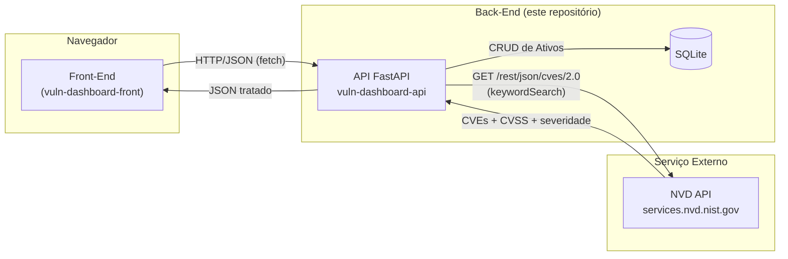

# Painel de Vulnerabilidades por Software — API (Back-End)

API REST em **Python + FastAPI** para cadastro de ativos (softwares/versões usados
em uma infraestrutura) e consulta de vulnerabilidades conhecidas (**CVEs**)
relacionadas, usando a **NVD API** (National Vulnerability Database) como serviço
externo.

Este repositório implementa a camada **API (Back-End)** do MVP, seguindo o
**Cenário 1.1**: Interface (Front-End) + API (Back-End) + API Externa.

> Repositório irmão: [`vuln-dashboard-front`](../vuln-dashboard-front) — a interface web que consome esta API.

## Sumário

- [Arquitetura](#arquitetura)
- [Tecnologias](#tecnologias)
- [Estrutura de pastas](#estrutura-de-pastas)
- [Instalação e execução local](#instalação-e-execução-local)
- [Execução via Docker](#execução-via-docker)
- [Rotas da API](#rotas-da-api)
- [A API externa: NVD](#a-api-externa-nvd)
- [Tratamento de erros](#tratamento-de-erros)
- [Variáveis de ambiente](#variáveis-de-ambiente)

## Arquitetura



O front-end **nunca** chama a NVD diretamente: toda consulta passa pela API,
que centraliza a integração externa, aplica cache e trata erros antes de
responder ao cliente.

## Tecnologias

- **FastAPI** — framework web e documentação Swagger/OpenAPI automática
- **SQLAlchemy** — ORM
- **SQLite** — banco de dados (arquivo local, zero configuração)
- **httpx** — cliente HTTP assíncrono para consumir a NVD API
- **Uvicorn** — servidor ASGI

## Estrutura de pastas

```
vuln-dashboard-api/
├── app/
│   ├── main.py              # criação do app FastAPI, CORS, health check
│   ├── database.py          # engine/sessão do SQLAlchemy
│   ├── models.py            # modelo ORM Ativo
│   ├── schemas.py           # schemas Pydantic (request/response)
│   ├── auth.py              # autenticação simples por API Key (rotas de escrita)
│   ├── routers/
│   │   └── ativos.py        # rotas /ativos (CRUD, vulnerabilidades, resumo)
│   └── services/
│       └── nvd_service.py   # integração com a NVD API + cache + erros
├── requirements.txt
├── Dockerfile
├── .dockerignore
├── .env.example
└── README.md
```

## Instalação e execução local

Pré-requisitos: Python 3.11+.

```bash
cd vuln-dashboard-api

# 1. Criar e ativar um ambiente virtual
python -m venv venv
source venv/bin/activate        # Windows: venv\Scripts\activate

# 2. Instalar dependências
pip install -r requirements.txt

# 3. (opcional) copiar variáveis de ambiente
cp .env.example .env

# 4. Rodar em modo desenvolvimento (recarrega ao salvar arquivos)
uvicorn app.main:app --reload --port 8000
```

A API estará em `http://localhost:8000` e a documentação Swagger interativa em
`http://localhost:8000/docs` (ReDoc em `/redoc`). O banco `vuln_dashboard.db`
(SQLite) é criado automaticamente na primeira execução.

## Execução via Docker

```bash
cd vuln-dashboard-api

# build da imagem
docker build -t vuln-dashboard-api .

# executar, persistindo o banco em um volume nomeado
docker run -d \
  --name vuln-dashboard-api \
  -p 8000:8000 \
  -v vuln_dashboard_data:/app/data \
  vuln-dashboard-api
```

A API ficará disponível em `http://localhost:8000/docs`.

Para rodar back-end e front-end juntos com um único comando, veja o
`docker-compose.yml` no repositório do front-end.

## Rotas da API

| Método | Rota                              | Descrição                                                        | Auth |
|--------|------------------------------------|-------------------------------------------------------------------|------|
| POST   | `/ativos`                          | Cadastra um novo ativo                                             | ✅ (opcional) |
| GET    | `/ativos`                          | Lista ativos (`categoria`, `page`, `page_size`, `ordenar_por`)     | –    |
| PUT    | `/ativos/{id}`                     | Atualiza um ativo                                                  | ✅ (opcional) |
| DELETE | `/ativos/{id}`                     | Remove um ativo                                                    | ✅ (opcional) |
| GET    | `/ativos/{id}/vulnerabilidades`    | Consulta CVEs relacionados ao ativo na NVD                         | –    |
| GET    | `/ativos/{id}/resumo`              | Contagem de CVEs por severidade (CRITICAL/HIGH/MEDIUM/LOW)         | –    |

Exemplos de uso de `GET /ativos`:

```
GET /ativos?categoria=servidor%20web&page=1&page_size=10&ordenar_por=nome
```

A documentação completa e interativa (com "Try it out") fica em `/docs`
assim que a API estiver no ar.

### Exemplo de resposta de `GET /ativos/{id}/vulnerabilidades`

```json
{
  "ativo_id": 1,
  "termo_busca": "nginx 1.18",
  "total_encontrado": 3,
  "origem_cache": false,
  "vulnerabilidades": [
    {
      "cve_id": "CVE-2021-23017",
      "descricao": "A security issue in nginx resolver...",
      "score_cvss": 7.7,
      "severidade": "HIGH",
      "data_publicacao": "2021-05-25T15:15:00"
    }
  ]
}
```

## A API externa: NVD

- **Nome**: National Vulnerability Database (NVD), mantida pelo NIST (governo dos EUA)
- **Documentação**: https://nvd.nist.gov/developers/vulnerabilities
- **Endpoint consumido**: `GET https://services.nvd.nist.gov/rest/json/cves/2.0`
- **Parâmetro usado**: `keywordSearch` (montado a partir de `nome + versao` do ativo, ex.: `"nginx 1.18"`)
- **Licença/uso**: serviço público e gratuito do governo dos EUA (NIST). Os dados
  da NVD são de domínio público (conforme a política de dados do NIST), mas o
  serviço tem **limites de requisições** (rate limit).
- **Chave de API**: **não é obrigatória**. Sem chave, o limite é de
  aproximadamente 5 requisições a cada 30 segundos; com uma chave gratuita
  (solicitada em https://nvd.nist.gov/developers/request-an-api-key), o limite
  sobe para ~50 requisições a cada 30 segundos. Quando definida, a chave é
  enviada no header `apiKey` da chamada feita pelo back-end — o front-end nunca
  tem contato com essa chave.
- Campos extraídos da resposta da NVD e devolvidos já tratados pela nossa API:
  `cve_id` (id CVE), `descricao` (em inglês, conforme a NVD disponibiliza),
  `score_cvss` e `severidade` (prioriza métricas CVSS v3.1 → v3.0 → v2) e
  `data_publicacao`.

## Tratamento de erros

A integração com a NVD trata explicitamente:

| Situação                                   | Resposta da nossa API        |
|--------------------------------------------|-------------------------------|
| Timeout na chamada à NVD                   | `504 Gateway Timeout`         |
| Rate limit da NVD (HTTP 403/429)           | `429 Too Many Requests`       |
| Erro de servidor da NVD (5xx) ou de rede   | `502 Bad Gateway`             |
| Nenhum CVE encontrado para o termo         | `200 OK` com lista vazia      |
| Ativo inexistente                          | `404 Not Found`               |

## Variáveis de ambiente

Veja `.env.example` para a lista completa. Nenhuma é obrigatória — a API roda
com os valores padrão (SQLite local, sem chave da NVD, CORS liberado, sem
autenticação nas rotas de escrita).

Destaque:

- `WRITE_API_KEY`: se definida, `POST`/`PUT`/`DELETE` em `/ativos` passam a
  exigir o header `X-API-Key` com esse valor.
- `NVD_CACHE_TTL_SECONDS`: por quanto tempo o resultado de uma consulta à NVD
  fica em cache em memória antes de ser buscado novamente (evita repetir
  chamadas idênticas em pouco tempo).

## Conformidade com os requisitos do MVP (Cenário 1.1)

- [x] API REST em Python (FastAPI) com rotas **GET**, **POST**, **PUT** e **DELETE**, documentação Swagger automática em `/docs`
- [x] Persistência com SQLite via SQLAlchemy
- [x] README com título, descrição, instruções de instalação e diagrama de arquitetura (Mermaid)
- [x] Dockerfile funcional na raiz do repositório
- [x] Sem `docker-compose.yml` neste repositório (fica apenas na raiz do repositório da Interface, conforme a regra do MVP)
- [x] Consumo de API externa pública e gratuita (NVD), sem redirecionar o usuário — dados tratados e devolvidos já prontos
- [x] Funcionalidades extras além do CRUD básico: filtros, ordenação, paginação, cache de consultas e autenticação opcional por API Key
- [x] snake_case em todo o código Python (PEP 8)
